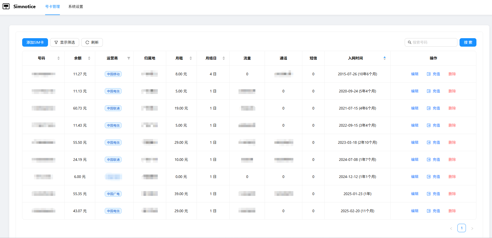
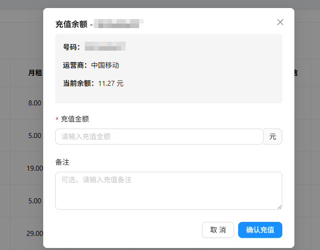
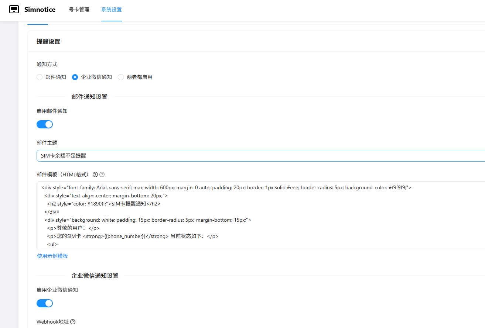

# Simnotice - SIM卡管理与提醒系统

一个用于管理SIM卡信息并提供余额不足提醒的系统。同时支持自动扣费和交易记录追踪功能。

## 功能特点

- 管理多种运营商的SIM卡信息
- 显示号码、余额、运营商、月租、归属地等信息
- 按入网时间排序和多条件筛选功能
- 余额不足提醒（邮件或企业微信）
- 自动扣除月租费（系统在月结日自动扣除）
- 手动充值功能（支持备注）
- 完整交易记录跟踪（自动扣费和手动充值）
- 自定义通知设置和模板

## 项目预览





## 技术栈

- 前端：React.js + Ant Design
- 后端：Node.js + Express
- 数据库：MySQL
- 邮件服务：Nodemailer
- 企业微信通知

## 安装与启动

### 前提条件

- Node.js (>= 14.x)
- MySQL (>= 8.0)

### 安装步骤

1. 克隆项目
2. 安装依赖
   ```bash
   cd backend
   npm install
   cd ../frontend
   npm install
   ```
3. 配置环境变量
   在 backend 目录创建`.env`文件，参考以下配置:
   ```
   # 数据库配置
   DB_HOST=localhost
   DB_USER=root
   DB_PASSWORD=your_password
   DB_NAME=simnotice_db
   DB_PORT=3306
   
   # 服务器配置
   PORT=9501
   
   # 邮件配置
   EMAIL_HOST=smtp.your-email-provider.com
   EMAIL_PORT=465
   EMAIL_USER=your_email@example.com
   EMAIL_PASS=your_email_password
   EMAIL_FROM=your_email@example.com
   
   # 接收通知的邮箱
   RECIPIENT_EMAIL=your_email@example.com
   
   # 通知配置
   BALANCE_THRESHOLD=10  # 余额低于此值时发送提醒（单位：元）
   ```

4. 启动应用（自动初始化数据库）
   ```bash
   cd backend
   npm run dev
   ```
   系统会自动检测并初始化数据库。
   
   新开终端启动前端:
   ```bash
   cd frontend
   npm run dev
   ```

## 使用说明

访问 http://localhost:3000 即可使用系统。

### SIM卡管理

系统提供完整的SIM卡信息管理功能：

- **添加SIM卡**：点击"添加SIM卡"按钮，填写相关信息
- **编辑SIM卡**：点击列表中SIM卡行的"编辑"按钮
- **删除SIM卡**：点击列表中SIM卡行的"删除"按钮
- **筛选功能**：支持按号码、运营商、归属地、余额范围和入网时间进行筛选
- **排序功能**：可按入网时间、余额等字段排序（默认按入网时间排序，时间越久越靠前）

### 余额管理

系统提供两种余额变更方式：

1. **自动扣费**：系统在每月月结日自动扣除月租费
2. **手动充值**：点击列表中SIM卡行的"充值"按钮，输入充值金额和备注

所有余额变动都会被记录到交易历史中，方便后续查询和审计。

## 定时任务功能

系统已集成定时任务服务，在后端执行 `npm run dev` 启动时自动安排以下任务：

### 自动余额检查
- **时间**: 每天上午 8:00 (北京时间)
- **功能**: 检查所有SIM卡余额，低于阈值时发送通知

### 自动扣费功能  
- **时间**: 每天凌晨 1:00 (北京时间)
- **功能**: 检查当天到月结日的SIM卡，自动扣除月租费

### 手动执行命令（测试用途）
```bash
npm run check-balance    # 手动执行余额检查
npm run auto-billing     # 手动执行自动扣费
```

### 自动扣费流程
1. 系统检查当天是否有SIM卡的月结日
2. 对于月结日的SIM卡，系统会自动从余额中扣除月租费
3. 如果余额不足，系统会发送通知但不会扣费
4. 所有扣费记录都会被记录到交易历史中

## 交易记录功能

系统自动记录所有余额变动：

- **自动扣费**：每月扣除月租费的记录
- **手动充值**：管理员手动为SIM卡充值的记录


## 通知功能

系统支持两种通知方式：

1. **邮件通知**：使用SMTP服务发送邮件
2. **企业微信通知**：通过Webhook发送消息到企业微信群

通知触发条件：
- SIM卡余额低于设定阈值
- 余额不足，无法扣除月租费
- 扣费后余额低于阈值

## 配置说明

### 数据库配置
- `DB_HOST`: 数据库主机地址
- `DB_USER`: 数据库用户名
- `DB_PASSWORD`: 数据库密码
- `DB_NAME`: 数据库名称
- `DB_PORT`: 数据库端口

### 邮件配置
- `EMAIL_HOST`: 邮件服务器主机地址
- `EMAIL_PORT`: 邮件服务器端口
- `EMAIL_USER`: 邮箱账号
- `EMAIL_PASS`: 邮箱密码
- `EMAIL_FROM`: 发件人地址（通常与邮箱账号相同）
- `RECIPIENT_EMAIL`: 接收余额不足提醒的邮箱地址

### 通知配置
- `BALANCE_THRESHOLD`: 余额阈值，低于此值时发送提醒（单位：元）

## 常见问题

1. **如何设置企业微信通知？**
   - 在系统设置中填写企业微信机器人的Webhook地址
   - 可以使用`npm run test-wechat`命令测试企业微信通知

2. **如何修改通知模板？**
   - 邮件和企业微信通知模板可在系统设置中修改
   - 支持HTML（邮件）和Markdown（企业微信）格式
